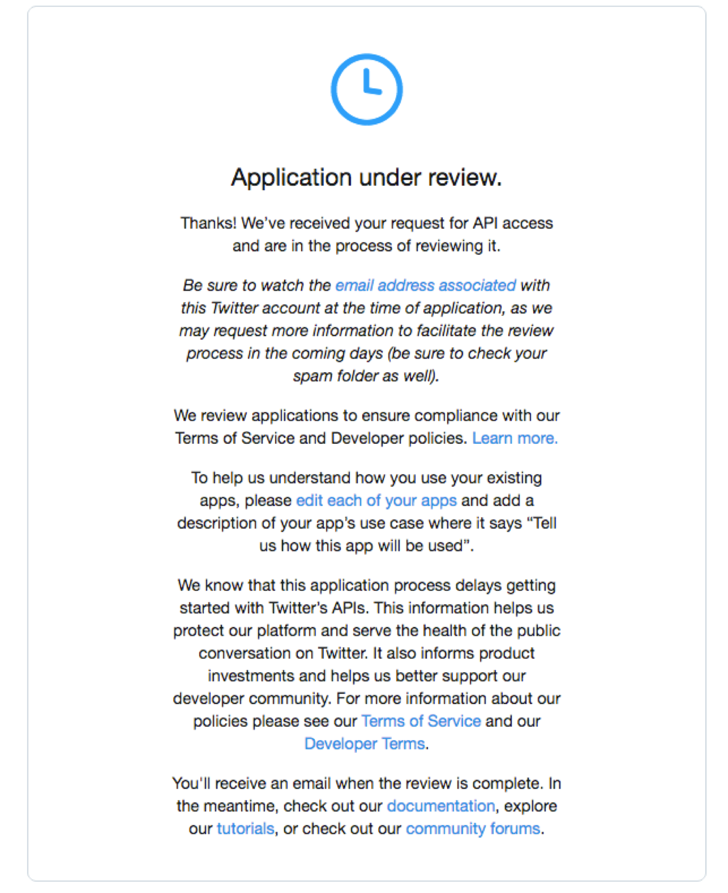
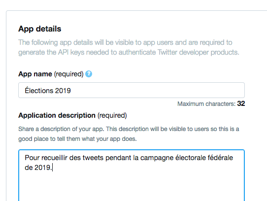
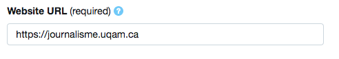
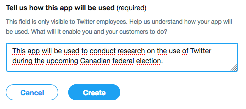
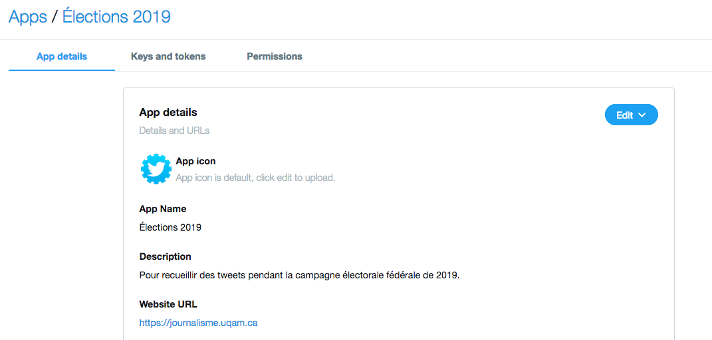
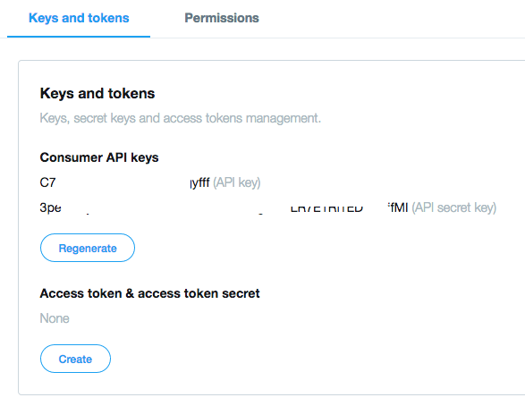
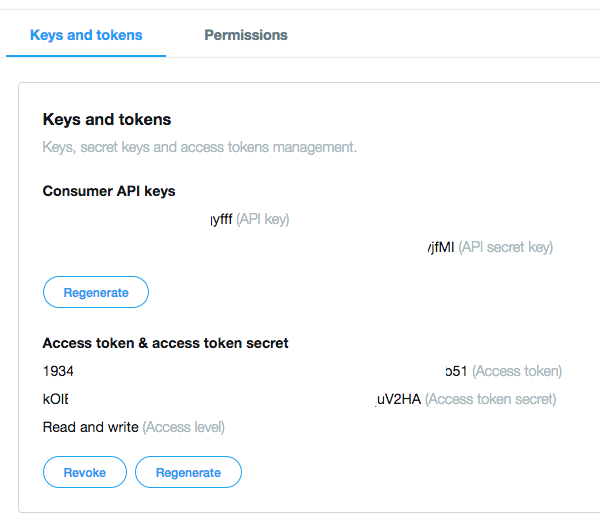
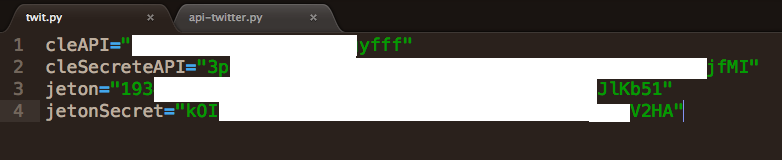

# Moissonner des données grâce à l’API de Twitter
### En trois étapes faciles

### Étape 1 - S’inscrire comme développeur

Autrefois très ouvert, l’API de Twitter s’est refermé un peu en 2018. Il faut désormais y demander un accès. Le processus est gratuit, mais un peu laborieux.

Il faut d’abord se rendre dans la [section *Developers* de Twitter](https://developer.twitter.com) et cliquer sur le bouton « Apply », dans le coin supérieur droit.


On vous demandera de répondre à quatre pages de questions. C’est la partie plate. Une fois que ce sera fait, Twitter va vous dire qu’il va analyser votre demande.

<a href="assets/twitterPatteBlanche.png" target="_blank"></a>


Mais c’est rapide. Début février 2019, Twitter a répondu à ma demande d’accès en 24h environ.

### Étape 2 - Créer une app


Maintenant que vous êtes un développeur reconnu, vous êtes en mesure d’interagir avec l’API de Twitter. La façon d’y parvenir est de créer une [app](https://developer.twitter.com/en/apps). Ici encore, le processus n’est pas compliqué.

Vous donnez un nom à votre app et une description.




Certains champs sont obligatoires. Au champ «&nbsp;Website URL&nbsp;», entrez l’adresse du site web du programme.




Il faut aussi expliquer comment votre app va être utilisée. Soyez le plus transparent possible. Ici, il est préférable d’écrire en anglais pour que l’équipe de Twitter puisse vous lire.




Et voilà! Votre app est créée!




Dans l’onglet *Keys and tokens*, cliquez sur *Create* pour générer deux jetons supplémentaires.





Vous aurez besoin de ces quatre codes pour passer à l’étape suivante.

### Programmer un script pour aller chercher des données.

Pour éviter de publier par inadvertance ces quatre codes dans github, je vous conseille d’abord de créer un fichier à part dans lequel vous définirez quatre variables contenant ces codes. Vous pourrez baptiser ce ficher **twit.py**.



Vous êtes presque prêt.e à coder.

Il vous reste à aller chercher un *«&nbsp;wrapper&nbsp;»* pour faciliter la programmation de votre script. Je vous conseille [python-twitter](https://github.com/bear/python-twitter).

Pour pouvoir l’utiliser, dans le Terminal ou votre *«&nbsp;Anaconda prompt&nbsp;»*, tapez

`pip install python-twitter`

Voilà. Vous pouvez désormais commencer à programmer.

Vous commencez votre script avec

```python
# coding: utf-8
```

Puis, vous pouvez commencer par importer quatre choses:
- le module CSV, afin d’enregistrer les infos contenues par les tweets que vous trouverez dans un fichier de données
- le module JSON, afin de décoder ce que l’API nous retourne
- le module python-twitter que vous venez d’installer (on peut réduire son nom à *twitter*)
- vos quatre codes importants à partir du fichier twit.py que vous avez créé précédemment

```python
import csv
import json
import twitter
from twit import cleAPI, cleSecreteAPI, jeton, jetonSecret
```

Dans une variable que vous pouvez appeler *t*, vous invoquez ensuite la méthode *.Api()* du module *twitter* et y importez vos quatre codes importants.

Votre variable *t* deviendra en quelque sorte votre trousseau de clé pour déverrouiller Twitter.

```python
t = twitter.Api(consumer_key=cleAPI,
	consumer_secret=cleSecreteAPI,
	access_token_key=jeton,
	access_token_secret=jetonSecret,
	tweet_mode="extended"
	)
```

Vous pouvez ensuite passer dans une variable un mot que vous cherchez. Cela peut être un hashtag (#) ou un utilisateur (@). Cela peut aussi être une expression booléenne comme **#meetoo OR #moiaussi**.

Ça peut être une liste d’expressions. Vous pouvez confiner différentes expressions dans un fichier CSV, le lire et rechercher toutes ces expressions dans Twitter.

Vous pouvez aussi demander à la personne qui fera fonctionner votre script d’inscrire une expression de son choix.

```python
onCherche = input("Quel mot ou expression? ")
```

Puis voici comment rédiger une recheche au moyen de l’API de Twitter.<br>
Ici, on cherche le contenu de notre variable *onCherche* et Twitter va nous retourner du .json comprenant les 500 (c’est le maximum) tweets les plus récents avec cette expression publiés au cours des 30 derniers jours.<br>
Vous pouvez placer tout cela dans une variable qu’on peut appeler *tweets* au moyen de la méthode *.GetSearch()*.

```python
tweets = t.GetSearch(term=onCherche,count=500,result_type="recent",return_json=True)
```

Il en existe d'autres, comme *.GetUserTimeline()* pour aller chercher les 3&nbsp;200 derniers tweets d'un utilisateur donné, *.GetStatus()* pour retrouver un tweet en particulier ou *.GetFriends()* pour trouver les amis d'un utilisateur. Il y en a plusieurs autres dont la syntaxe est décrite dans [la documentation de twitter-python](https://python-twitter.readthedocs.io/en/latest/twitter.html).

Allez voir ce que contient la variable *tweets*.

C’est du JSON que vous pouvez embellir.

```python
print(json.dumps(tweets, indent=2, sort_keys=True))
```

Chaque tweet est un **statut**. C’est ainsi que la clé qui contient les jusqu’à 500 tweets qu’on a demandés s’appelle *statuses*. On peut y faire une boucle pour aller chercher des informations pertinentes sur chacun des tweets.

```python
for tweet in tweets["statuses"]:
	print("Date/heure ", tweet["created_at"])
	print("Contenu ", tweet["full_text"])
	print("Pseudo ", tweet["user"]["name"])
	print("Retweets ", tweet["retweet_count"])
	print("P'tits coeurs ", tweet["favorite_count"])
	print("*"*60)
```

Si vous voulez enregistrer toutes ces informations, vous pouvez les consigner dans un fichier CSV en utilisant [la même recette que celle que vous avez apprise la semaine dernière](lireapi.py).
