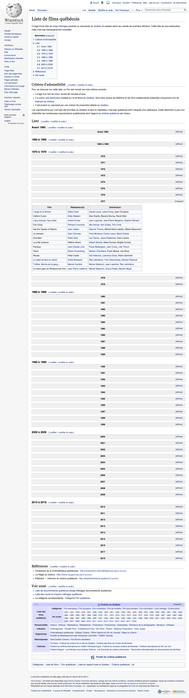

# Moissonnage simple avec Google Sheets

Vous pouvez aller chercher certaines données automatiquement sur le web grâce à [Google Sheets](https://docs.google.com/spreadsheets). Le tableur de Google contient en effet certaines fonctions uniques.

La plus utile et facile à comprendre est certainement

`=IMPORTHTML()`

Cette fonction prend trois arguments.

<code>=IMPORTHTML(<i>url</i>;<i>type</i>;<i>index</i>)</code>

**url** 
L’argument *url* est simplement l’URL de la page web où se trouvent les données qui vous intéressent.

**type** 
L’argument *type* permet de préciser si les données se trouvent dans un tableau ou dans une liste. C’est ainsi qu’il ne peut prendre que deux valeurs: `"table"` ou `"list"`.

**type** 
L’argument *index*, enfin, est utile pour dire à la fonction lequel des tableaux ou laquelle des listes elle doit recueillir.

### Premier exemple avec des données structurées en tableaux.

Admettons que vous souhaitiez récupérer la [liste de tous les films québécois se trouvant dans Wikipédia](https://fr.wikipedia.org/wiki/Liste_de_films_québécois).

Cette liste est découpée en plusieurs tableaux, généralement un par année. Dans l’image ci-dessous, le tableau déployé est celui des films de 1977, une grande année marquée par l’inénarrable [Ti-Mine, Bernie, pis la gang…](https://fr.wikipedia.org/wiki/Ti-Mine,_Bernie_pis_la_gang...)

Dans une feuille de calcul Google, si vous entrez la commande suivante, vous allez voir apparaître le premier tableau de cette page :

`=IMPORTHTML("https://fr.wikipedia.org/wiki/Liste_de_films_qu%C3%A9b%C3%A9cois";"table";1)`

Comme les données sont dans des tableaux, des éléments HTML `<table>`, le deuxième argument est `"table"`.

Comme on commence par capturer le contenu du premier tableau, le dernier argument de la fonction est `1`. Pour récupérer le deuxième tableau, il suffit de changer le dernier argument par `2`. Et ainsi de suite.

Pour récupérer tout le contenu de cette page, vous pourriez simplement organiser votre feuille comme vous pouvez le découvrir dans l’onglet **Tableau** de [cette feuille de calcul](https://docs.google.com/spreadsheets/d/1rJkZFFvIony2JCkVbBad8dacvP7MOc8zSjaAhWIRgWM/edit#gid=0). Les formules se trouvent dans la colonne B vis-à-vis des nombres se trouvant dans la colonne A.

### Second exemple avec des données structurées en listes.

Rendez-vous maintenant dans [une autre page Wikipédia](https://fr.wikipedia.org/w/index.php?title=Catégorie:Rappeur_français&pageuntil=Roce
Rocé+(rappeur)#mw-pages) qui regroupe les noms de tous les rappeurs français qui font l’objet d’un article dans la grande encyclopédie en ligne.

Vous y constatez que les éléments qui nous intéressent, ici, ne se trouvent pas dans des tableaux, mais dans des listes (des éléments HTML de type `<li>`, se trouvant eux-mêmes dans des éléments `<ul>` ou `<ol>`).

Si vous entrez la commande suivante, vous allez saisir la 19e liste de cette page, soit les rappeurs dont le nom commence par M.

`=IMPORTHTML("https://fr.wikipedia.org/w/index.php?title=Catégorie:Rappeur_français&pageuntil=Roce
Rocé+(rappeur)#mw-pages »;"list";19)`

Ici aussi, il est possible de récupérer tout le contenu de cette page en organiser votre feuille comme vous pouvez le découvrir dans l’onglet **Listes** de [cette feuille de calcul](https://docs.google.com/spreadsheets/d/1rJkZFFvIony2JCkVbBad8dacvP7MOc8zSjaAhWIRgWM/edit#gid=0). Les formules se trouvent cette fois sur la 3e ligne, juste sous une série de nombres correspondant au rang de la liste dont on souhaite récupérer le contenu.